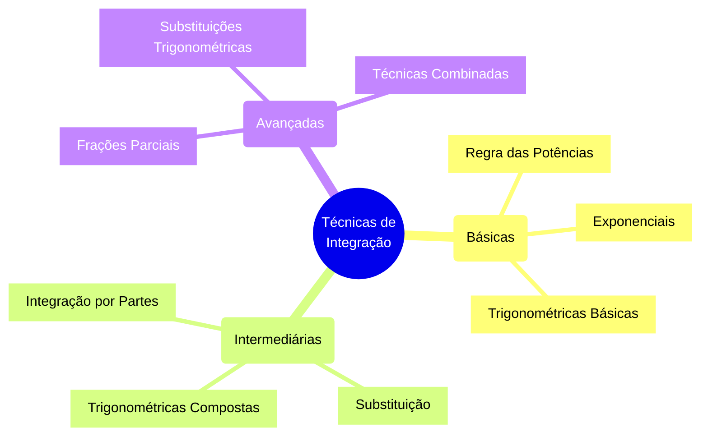
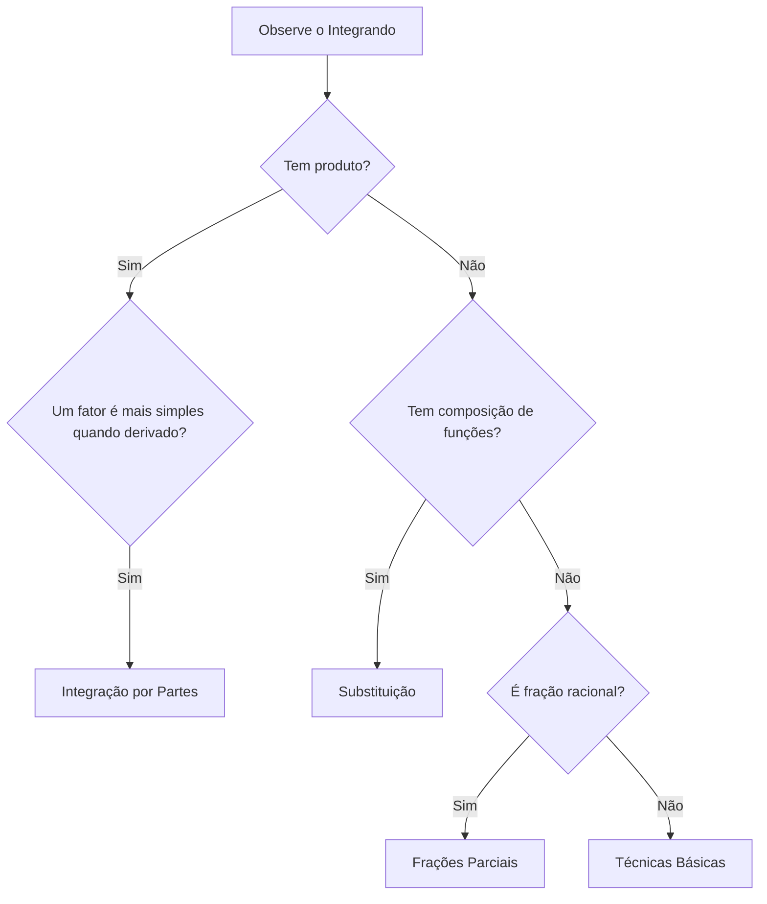
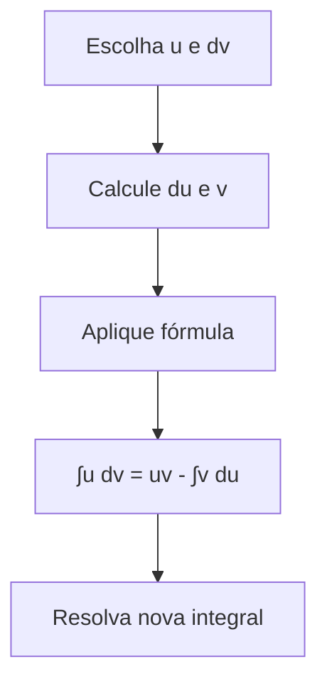

# Guia de Estudo: Integrais - Preparação para Prova (21/11)

## Lista de Exercícios

### Nível Básico (5 exercícios)

1️⃣ **Integral Básica de Potência**
   * Calcule: ∫(2x³ + 5x) dx
   * Dica: Aplique a regra das potências termo a termo
   * Solução: (1/2)x⁴ + (5/2)x² + C

2️⃣ **Integral Exponencial Simples**
   * Calcule: ∫e^x dx
   * Dica: Lembre-se que a exponencial é sua própria derivada
   * Solução: e^x + C

3️⃣ **Integral Trigonométrica Básica**
   * Calcule: ∫sen(x) dx
   * Dica: Lembre-se da derivada do cosseno
   * Solução: -cos(x) + C

4️⃣ **Integral de Função Racional Simples**
   * Calcule: ∫(1/x) dx
   * Dica: Caso especial n = -1 na regra das potências
   * Solução: ln|x| + C

5️⃣ **Integral com Coeficientes**
   * Calcule: ∫(3x² - 2x + 4) dx
   * Dica: Integre termo a termo, mantendo os coeficientes
   * Solução: x³ - x² + 4x + C

### Nível Intermediário (3 exercícios)

6️⃣ **Integral por Partes**
   * Calcule: ∫x·ln(x) dx
   * Dica: Use u = ln(x) e dv = x dx
   * Solução: 
     1. u = ln(x), dv = x dx
     2. du = (1/x)dx, v = x²/2
     3. = (x²/2)ln(x) - ∫(x²/2)(1/x)dx
     4. = (x²/2)ln(x) - (x²/4) + C

7️⃣ **Integral Trigonométrica Composta**
   * Calcule: ∫sen²(x) dx
   * Dica: Use a identidade sen²(x) = (1 - cos(2x))/2
   * Solução: x/2 - sen(2x)/4 + C

8️⃣ **Integral com Substituição**
   * Calcule: ∫(2x + 1)⁵ dx
   * Dica: Faça u = 2x + 1
   * Solução:
     1. u = 2x + 1
     2. du = 2dx
     3. dx = du/2
     4. = (1/2)∫u⁵ du
     5. = (1/2)(u⁶/6) + C
     6. = (2x + 1)⁶/12 + C

### Nível Avançado (2 exercícios)

9️⃣ **Integral por Frações Parciais**
   * Calcule: ∫(x/(x² - 1)) dx
   * Dica: Decomponha em frações parciais A/(x-1) + B/(x+1)
   * Solução:
     1. x/(x² - 1) = A/(x-1) + B/(x+1)
     2. x = A(x+1) + B(x-1)
     3. x = (A+B)x + (A-B)
     4. A+B = 1, A-B = 0
     5. A = 1/2, B = 1/2
     6. = (1/2)∫(1/(x-1) + 1/(x+1)) dx
     7. = (1/2)(ln|x-1| + ln|x+1|) + C

🔟 **Integral com Múltiplas Técnicas**
   * Calcule: ∫x·e^(x²) dx
   * Dica: Substituição u = x²
   * Solução:
     1. u = x²
     2. du = 2x dx
     3. x dx = du/2
     4. = (1/2)∫e^u du
     5. = (1/2)e^u + C
     6. = (1/2)e^(x²) + C

## Mapa Mental de Técnicas de Integração



## Dicas para Identificar o Método Correto



## Checklist de Conceitos Importantes

- [ ] Regra das Potências
  * ∫xⁿ dx = (xⁿ⁺¹)/(n+1) + C, n ≠ -1
  * Caso especial: ∫(1/x) dx = ln|x| + C

- [ ] Exponenciais e Logaritmos
  * ∫eˣ dx = eˣ + C
  * ∫aˣ dx = aˣ/ln(a) + C
  * ∫ln(x) dx = x·ln(x) - x + C

- [ ] Trigonométricas Básicas
  * ∫sen(x) dx = -cos(x) + C
  * ∫cos(x) dx = sen(x) + C
  * ∫sec²(x) dx = tg(x) + C

- [ ] Técnicas Avançadas
  * Integração por Partes: ∫u dv = uv - ∫v du
  * Substituição: u = g(x), du = g'(x)dx
  * Frações Parciais: decomposição em frações mais simples

## Dicas para a Prova

1. **Primeiro Passo**: Sempre identifique o tipo de integral antes de começar
2. **Simplificação**: Verifique se é possível simplificar antes de integrar
3. **Verificação**: Derive sua resposta para confirmar se está correta
4. **Constante**: Nunca esqueça a constante de integração
5. **Tempo**: Comece pelos exercícios mais fáceis para ganhar confiança

## Erros Comuns a Evitar

1. Esquecer a constante de integração (C)
2. Errar sinais em integrais trigonométricas
3. Confundir qual parte escolher em integração por partes
4. Esquecer de fazer a substituição de volta para x
5. Não simplificar a expressão final

## Representações Visuais Importantes

### Integral Definida
```mermaid
graph LR
    A[Área sob a curva] --> B[∫ₐᵇ f(x)dx]
    B --> C[F(b) - F(a)]
    C --> D[Valor numérico]
```

### Integração por Partes

